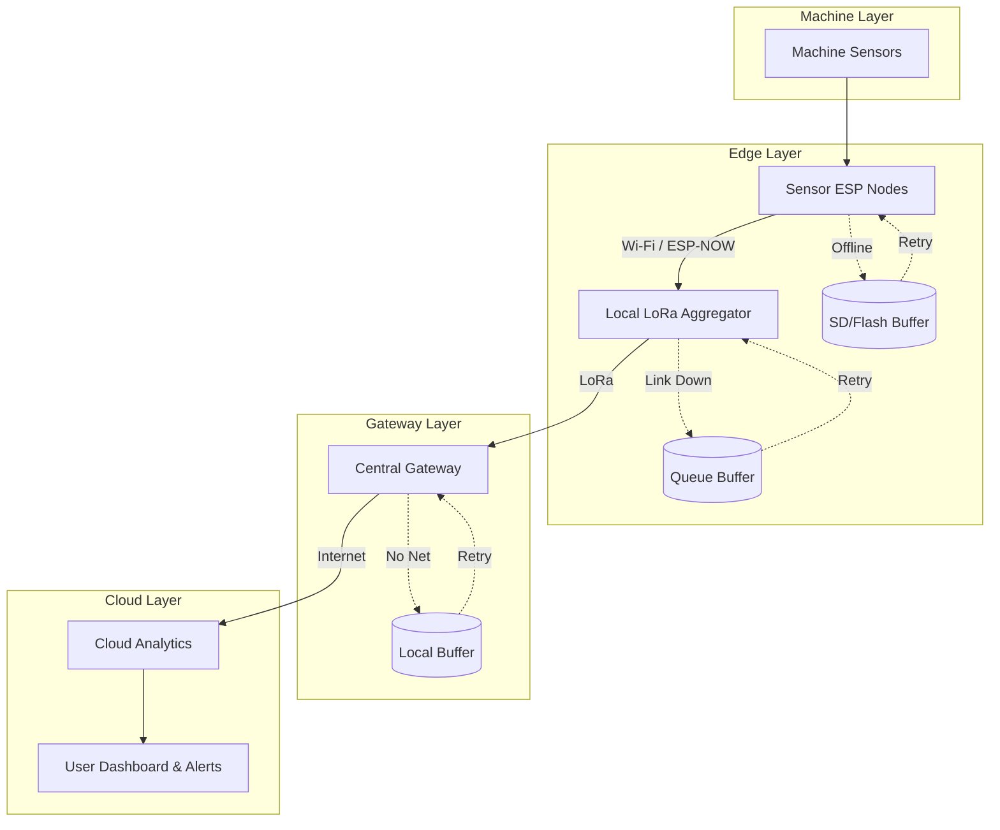
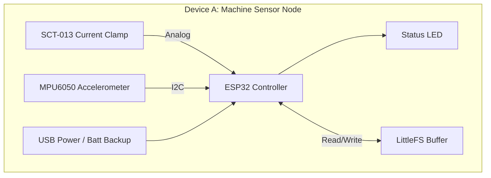
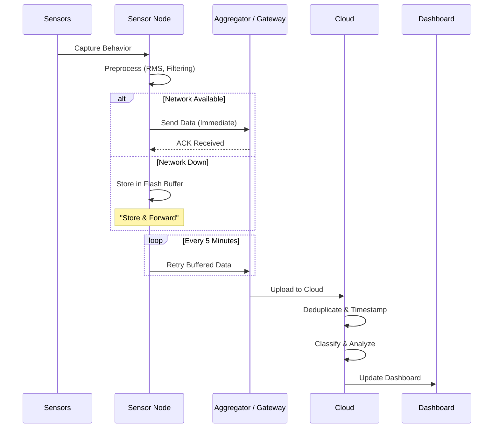
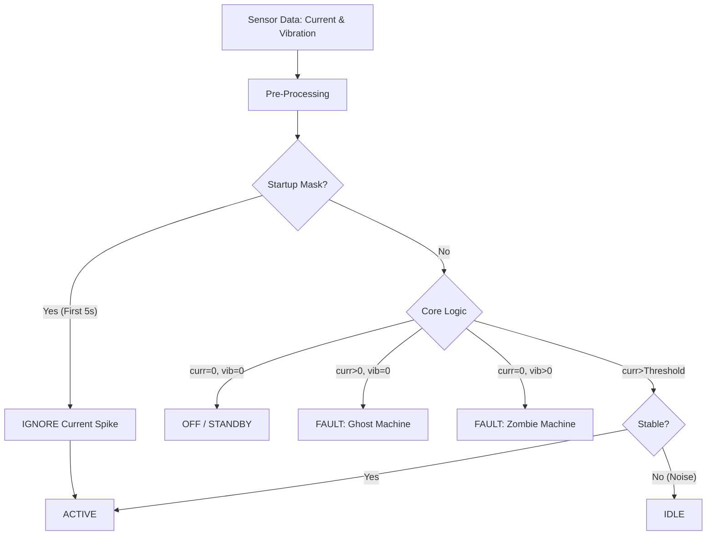

# 🧄 Garlic: The Immersive Industrial IoT Ecosystem


> 🚧 **Work in Progress**: This project is currently under active development. Some features may be experimental.

> **Empowering Factory Floors with 3D Visibility and Ultra-Low Power Edge Intelligence.**

Garlic is an industrial-grade **Power & Vibration Monitoring System** designed for real-time predictive maintenance. It combines a custom **3-Tier Mesh Network** with a **Digital Twin UI** to deliver actionable insights, not just data.

---

## 🏆 Key Features (Why Garlic Wins)

*   **Stick & Play Deployment**: Zero wiring. Magnetic mount sensors auto-connect to the mesh.
*   **ROI < 2 Weeks**: At **₹600/node**, the system pays for itself by preventing a single breakdown.
*   **3D Digital Twin**: Visualize your factory floor in real-time with a WebGL-powered interface.
*   **Hybrid Wake-Up**: Operates on <10µA deep sleep, waking only on critical anomalies.
*   **Edge Intelligence**: On-device FFT and RMS analysis to filter noise before transmission.

---

## 🏗️ System Architecture

Garlic employs a **Star-of-Stars** topology to balance range (2km+) with power efficiency.

### High-Level Topology



---

## 🔧 Hardware Architecture

We utilize a modular 3-device strategy to optimize cost and coverage.

### 1. The Sensor Node (Edge)
*   **MCU**: ESP32 / ESP8266
*   **Sensors**: 
    *   **SCT-013**: Non-invasive Current Transformer (0-30A) for Load Monitoring.
    *   **MPU6050**: 6-Axis Accelerometer for Vibration Analysis.
*   **Power**: Li-Ion Battery with TP4056 charging + Deep Sleep mgmt.
*   **Comms**: ESP-NOW (Low Latency, Low Power).

### 2. The Aggregator (Fog)
*   **Role**: Collects high-speed data from local nodes and bridges to Long Range radio.
*   **Hardware**: ESP32 + SX1278 LoRa Module.
*   **Range**: Covers a 500m radius industrial zone.

### 3. The Gateway (Base)
*   **Role**: Central data backhaul to the Cloud.
*   **Hardware**: Raspberry Pi 4 / ESP32 Gateway.
*   **Connectivity**: 4G LTE / Wi-Fi / Ethernet.

#### Block Diagram: Sensor Node



---

## ☁️ Software & Data Pipeline

Garlic's software stack is built for resilience. If the network drops, data is buffered locally (Flash) and re-transmitted automatically.

### End-to-End Data Flow



### Advanced State Classification Logic



---

## 🛠️ Installation & Setup

1.  **Clone the Repository**:
    ```bash
    git clone https://github.com/your-username/garlic-iiot.git
    cd garlic-iiot
    ```

2.  **Flash the Firmware (PlatformIO)**:
    *   Open `Node/` in VS Code.
    *   Build and Upload to your ESP32 devices.

3.  **Start the Backend**:
    ```bash
    cd Cloud
    npm install
    node server.js
    ```

4.  **Launch the Dashboard**:
    Open `Dashboard/index.html` in your browser. (Ideally served via a web server).

---

## 🔮 Future Roadmap

*   **Hybrid Wake-Up**: Dual-stage monitoring logic (Always-on RMS + Triggered FFT Analysis).
*   **GenAI Integration**: "Factory Chat" to query machine status via Natural Language.
*   **3-Phase Support**: Expanded hardware for full 3-phase industrial power monitoring.

---

*Built with ❤️ by Shounak Das.*
