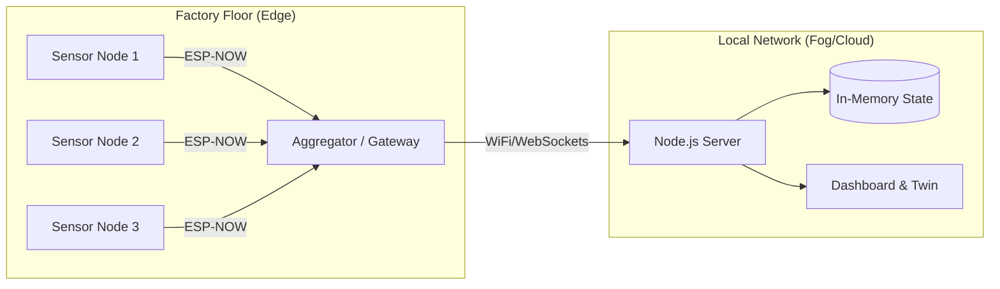

# Garlic: IIoT Architecture & Technical Breakdown

## 1. High-Level Architecture Overview

Garlic is designed as a **Hybrid Industrial IoT (IIoT) System** that bridges the gap between ultra-low-power edge sensing and high-fidelity real-time visualization.

The architecture follows a classic **Edge-Fog-Cloud** topology but introduces a novel "Hybrid Wake-Up" mechanism to optimize for both battery life and critical event latency.

### **System Topology**

**Key Differentiators:**
1.  **Protocol Translation**: Uses **ESP-NOW** (connectionless, low latency) for node-to-gateway communication, converting to **WebSockets** for the uplink.
2.  **Digital Twin Sync**: The physical state of machines is mirrored 1:1 in a simulated 3D environment.

---

## 2. Hardware Layer (The Edge)

The hardware is built around the **Espressif ESP32** ecosystem, chosen for its dual-core architecture and low-power coprocessor capabilities.

### **A. Sensor Node (The "Mote")**
*   **MCU**: ESP32-WROOM-32 / ESP32-C3
*   **Sensors**:
    *   **CT Sensor (Current Transformer)**: Non-invasive current measurement (0-30A) for calculating RMS Power.
    *   **MEMS Accelerometer (MPU6050/ADXL345)**: 3-axis vibration sensing for anomaly detection.
*   **Power Management**:
    *   **Deep Sleep Current**: ~10µA.
    *   **Wake-up Source**: ULP (Ultra Low Power) coprocessor or External Interrupt on vibration threshold.

### **B. The Gateway (The "Aggregator")**
*   **MCU**: ESP32-S3 (Higher processing power)
*   **Connectivity**:
    *   **Downlink**: ESP-NOW receiver (Promiscuous mode) to capture broadcast packets from thousands of nodes.
    *   **Uplink**: WiFi Station mode connecting to the factory intranet/cloud.

### **C. Hybrid Wake-Up Architecture**
Unlike traditional polling systems, our nodes do not stay awake.
1.  **Level 1 (Hardware/ULP)**: The device is in Deep Sleep. A crude hardware comparator watches the vibration sensor.
2.  **Level 2 (Pre-Processing)**: If vibration > threshold, the main CPU wakes up, takes a burst sample (FFT/RMS), and decides if it's a real anomaly.
3.  **Level 3 (Transmission)**: Only if data is significant is it transmitted via ESP-NOW.

---

## 3. Software Layer (The Stack)

### **A. Firmware (C++ / Arduino framework)**
*   **Real-time Sampling**: Uses DMA (Direct Memory Access) for high-speed ADC sampling of the current waveform.
*   **Edge Analytics**: Calculates RMS (Root Mean Square) locally on the chip to reduce payload size.
*   **ESP-NOW Integration**: Custom lightweight packet structure for <10ms transmission time.

### **B. Backend (Node.js)**
*   **Event-Driven**: Built on `ws` (WebSockets) to handle massive concurrency.
*   **State Management**: Maintains a live `Map` of all device states (`deviceMap`) for instant "Hot Sync" when new clients connect.
*   **Simulator**: An advanced "Chaos Engine" capable of simulating thousands of devices with probabilistic failure modes (Drift, Spike, Idle) for load testing.

### **C. Frontend (Dashboard & Digital Twin)**
*   **Dashboard**:
    *   **Tech**: HTML5, Vanilla CSS (Glassmorphism), Chart.js.
    *   **Features**: Real-time heatmaps, currency conversion (INR), efficiency tracking.
*   **Digital Twin**:
    *   **Tech**: **Three.js** (WebGL).
    *   **Visualization**: Isometric "White Factory" style.
    *   **Data Binding**: 3D objects (machines, particles) are instance-mapped to the backend's device IDs. A 1:1 reflection of physical reality.

---

## 4. Comparison: Garlic vs. Traditional IIoT

| Feature | Traditional SCADA / PLC | Generic Cloud IIoT (AWS/Azure) | **Garlic (Our Solution)** |
| :--- | :--- | :--- | :--- |
| **Architecture** | Wired (RS485/Modbus) | MQTT over WiFi/Cellular | **ESP-NOW Mesh + Gateway** |
| **Cost per Node** | High (₹15,000+) | Medium (₹2,000 - ₹5,000) | **Ultra-Low (< ₹800)** |
| **Battery Life** | N/A (Wired) | Days/Weeks (Always Connected) | **Years (Hybrid Wake-up)** |
| **Latency** | Low (<10ms) | Medium (Seconds) | **Low (<50ms local)** |
| **Setup Time** | Weeks (Cable laying) | Days (Provisioning) | **Minutes (Stick & Play)** |
| **Visualization** | 2D Schematics (Grey/Boring) | Dashboards (Graphs) | **Immersive 3D Digital Twin** |
| **Scalability** | Hard (Cable limits) | Soft limit (Cost/Bandwidth) | **Massive (Broadcast protocol)** |

### **Why Garlic Wins:**
1.  **Stick & Play Deployment**: No cables. Just stick the battery-powered sensor on the motor.
2.  **3D Context**: Instead of seeing "Sensor 45 is Alert", the operator sees "The CNC Machine in Sector 3 is flashing RED".
3.  **Cost Efficiency**: By offloading processing to the Edge (ESP32) and using a connectionless protocol (ESP-NOW), we reduce BOM cost and cloud ingress costs significantly.
