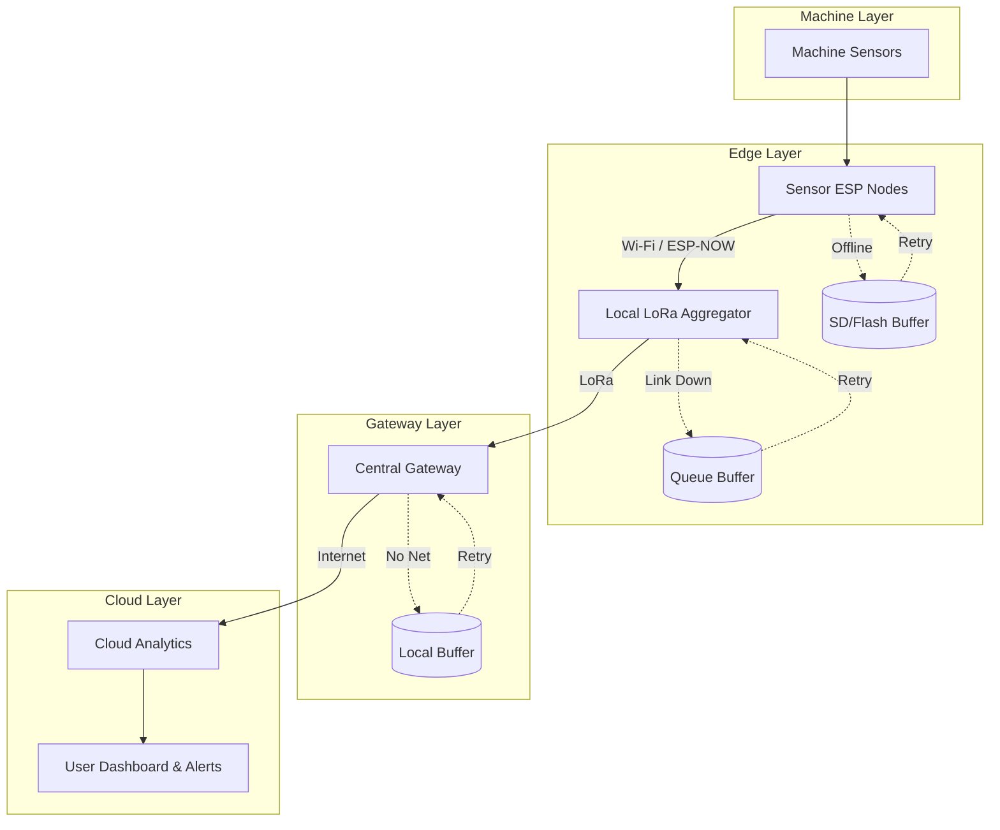
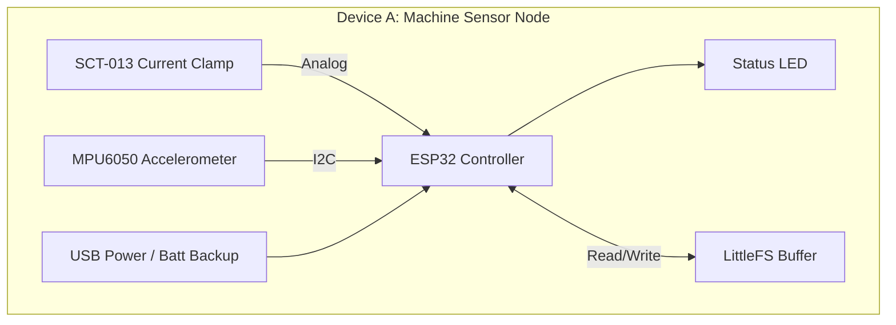
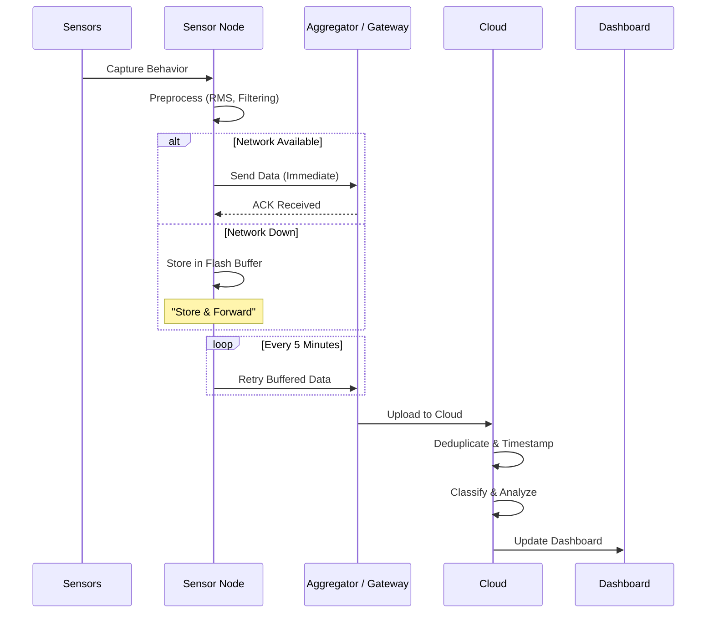
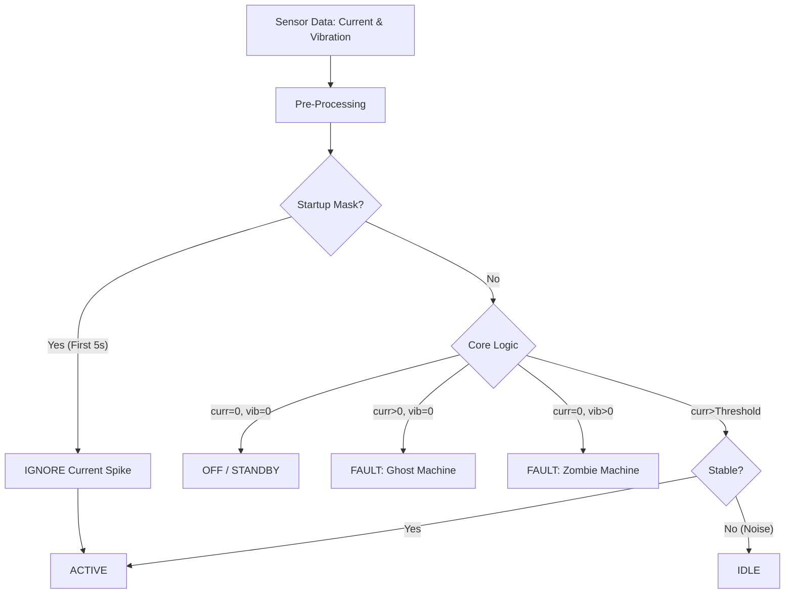

# Garlic - Architecture Diagrams (Industrial Grade)

## ✅ System Architecture - High-Level View

## ✅ Device A — Machine Sensor Node (Hardware Block)

## ✅ End-to-End Data Flow Pipeline (Resilient)

## ✅ State Classification Flow (Advanced)

